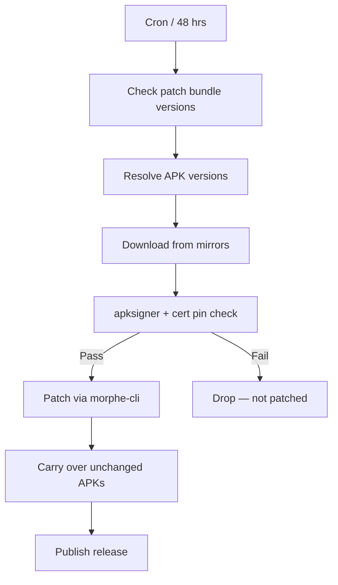

# Morphe-Automated-Build-Scripts

53 Android apps, patched and rebuilt every two days. No setup, no command line, just grab the APK and install it.

> [!IMPORTANT]
> Personal build pipeline, no affiliation with Google, YouTube, Meta, Amazon, ByteDance, or anyone else. Use at your own risk — account bans, device issues, and ToS violations are your problem, not mine.

---

## Quick start

### 1. Install GmsCore — YouTube, YouTube Music, Google Photos only
All three spoof Google services internally. [ReVanced GmsCore](https://github.com/ReVanced/GmsCore/releases/latest) has to be on your phone first or sign-in will break.

### 2. Download
[Latest Release](../../releases/latest) — find the APK you want, download it, install it.

---

## Supported applications

53 apps across four patch sources. Expand a section to see package names and what got changed.

<b>1. Morphe patches (3 apps)</b>

| App | Package | Changes |
|---|---|---|
| YouTube | `com.google.android.youtube` | Ad blocking, background play, SponsorBlock, layout customisation |
| YouTube Music | `com.google.android.apps.youtube.music` | Ad blocking, background play, premium audio controls |
| Reddit | `com.reddit.frontpage` | Ad blocking, media downloader, tracking removed |

<b>2. Piko patches (2 apps)</b>

| App | Package | Changes |
|---|---|---|
| Instagram | `com.instagram.android` | Ad blocking, AMOLED theme, anonymous story/DM viewing, reels auto-scroll off, high-res downloads |
| Twitter / X | `com.twitter.android` | Ad blocking, telemetry removed, login token import/export |

<b>3. hoo-dles patches (16 apps)</b>

| App | Package | Changes |
|---|---|---|
| AdGuard | `com.adguard.android` | Subscription features unlocked |
| Amazon Prime Video | `com.amazon.avod.thirdpartyclient` | Tracker blocking, interface cleanup |
| Duolingo | `com.duolingo` | Super Duolingo features, unlimited hearts, ad blocking |
| MyFitnessPal | `com.myfitnesspal.android` | Premium features unlocked |
| Nova Launcher | `com.teslacoilsw.launcher` | Nova Prime features unlocked |
| Solid Explorer | `pl.solidexplorer2` | Trial limitations removed |
| Xodo PDF | `com.xodo.pdf.reader` | Premium PDF tools unlocked |
| Ibis Paint X | `jp.ne.ibis.ibispaintx.app` | Premium drawing tools unlocked |
| WPS Office | `cn.wps.moffice_eng` | Premium tools unlocked |
| CamScanner | `com.intsig.camscanner` | Ad blocking, premium processing, clean exports |
| FotMob | `com.mobilefootie.wc2010` | Ad blocking, premium features |
| Pandora | `com.pandora.android` | Premium audio playback |
| Podcast Addict | `com.bambuna.podcastaddict` | Premium ad-free mode |
| ProtonVPN | `ch.protonvpn.android` | Subscription features unlocked |
| Windy | `com.windyty.android` | Premium weather tools |
| SofaScore | `com.sofascore.results` | Ad blocking, tracking removed |

<b>4. De-ReVanced / De-Vanced patches (32 apps)</b>

| App | Package | Changes |
|---|---|---|
| TikTok | `com.zhiliaoapp.musically` | Ad blocking, no download watermarks, seek bar enabled, reels auto-scroll |
| TikTok JP | `com.ss.android.ugc.trill` | Ad blocking, no watermarks |
| Twitch | `tv.twitch.android.app` | Live ad blocking, auto channel point claims, playback speed, chat customisation |
| Facebook | `com.facebook.katana` | Feed/story ad blocking, video downloading, telemetry removed |
| Messenger | `com.facebook.orca` | Ad blocking, tracking removed |
| Threads | `com.instagram.barcelona` | Ad blocking, tracking params stripped, media downloads |
| Disney+ | `com.disney.disneyplus` | Analytics and tracker blocking |
| SoundCloud | `com.soundcloud.android` | Ad blocking, background play, skip limits removed |
| Strava | `com.strava` | Ad blocking, extra stats visible |
| Tumblr | `com.tumblr` | Dashboard ad blocking, tracking removed |
| Amazon Shopping | `com.amazon.mShop.android.shopping` | Ad blocking, telemetry removed |
| Amazon Music | `com.amazon.mp3` | Ad blocking, background play |
| Google Photos | `com.google.android.apps.photos` | Unlimited backup via Pixel spoof, DCIM backup controls, GmsCore support |
| Google News | `com.google.android.apps.magazines` | Ad blocking, premium overlays removed |
| Google Recorder | `com.google.android.apps.recorder` | Offline transcription, installs on non-Pixel devices |
| ProtonMail | `ch.protonmail.android` | Plus features unlocked, tracking removed |
| Viber | `com.viber.voip` | Ad blocking, telemetry removed |
| Letterboxd | `com.letterboxd.letterboxd` | Ad blocking, premium features |
| Pixiv | `jp.pxv.android` | Ad blocking, high-res illustration search |
| Cricbuzz | `com.cricbuzz.android` | Ad blocking, premium features |
| Bandcamp | `com.bandcamp.android` | Premium play, media downloading |
| RAR | `com.rarlab.rar` | Ad blocking, premium tools |
| Photomath | `com.microblink.photomath` | Plus features, detailed step-by-step solutions |
| Peacock TV | `com.peacocktv.peacockandroid` | Tracker blocking, reduced ad load |
| Nothing X | `com.nothing.smartcenter` | Nothing device features on non-Nothing phones |
| Inshorts | `com.nis.app` | Ad blocking, premium features |
| Icon Pack Studio | `ginlemon.iconpackstudio` | Pro tier unlocked |
| Hex Editor | `com.myprog.hexedit` | Ad blocking, Pro features |
| GMX Mail | `de.gmx.mobile.android.mail` | Ad blocking, tracking removed |
| Angulus | `com.drinkplusplus.angulus` | Premium features unlocked |
| IRplus | `net.binarymode.android.irplus` | Ad blocking, Pro features |
| NU.nl | `nl.sanomamedia.android.nu` | Ad blocking, tracking removed |

---

## Recent patch updates

<!-- PATCH-UPDATES-START -->
_Last checked: 2026-09-03_

### [Morphe v1.41.0](https://github.com/MorpheApp/morphe-patches/releases/tag/v1.41.0)
* **Reddit:** Preserve font weights with system and custom fonts ([#2643](https://github.com/MorpheApp/morphe-patches/issues/2643))
* **Settings:** Keep search results in sync with preferences and highlight every match ([#2712](https://github.com/MorpheApp/morphe-patches/issues/2712))
* **Settings:** Resolve OOM crashes and prevent duplicate dialogs
* **Theme:** Add new color tokens and Litho hooks
* **YouTube - Add to queue:** Flyout menu is too wide and loses the item changes on rotation
* **YouTube - Advanced quality menu:** The menu is not show in some circumstances
* **YouTube - Change form factor:** Prevent tablet layout causing app to crash ([#2600](https://github.com/MorpheApp/morphe-patches/issues/2600))
* **YouTube - Hide ads:** Prevent unintended navigation button swap ([#2659](https://github.com/MorpheApp/morphe-patches/issues/2659))

### [De-ReVanced v1.3.1](https://github.com/RookieEnough/De-Vanced/releases/tag/v1.3.1)
* **Google Photos:** Fix avatar OAuth scope, JSON parser, and error logging

### [De-Vanced v1.3.1](https://github.com/RookieEnough/De-Vanced/releases/tag/v1.3.1)
* **Google Photos:** Fix avatar OAuth scope, JSON parser, and error logging

### [Piko v3.9.0](https://github.com/crimera/piko/releases/tag/v3.9.0)
* **Bring back Twitter:** restore omitted Twitter 9.98 terminology
* **instagram:** add dialog entity dependency for media downloads
* **Instagram:** block permission onboarding screens ([#1686](https://github.com/crimera/piko/issues/1686))
* **Instagram:** Check and add external downloader options in settings
* **Instagram:** Correct shared link sanitization ([#1698](https://github.com/crimera/piko/issues/1698))
* **Instagram:** don't record an unsend we never captured ([#1728](https://github.com/crimera/piko/issues/1728))
* **Instagram:** Fix default flag state while extracting recommended flags map
* **Instagram:** Fix more profile options ([#1708](https://github.com/crimera/piko/issues/1708))

### [hoo-dles v1.43.0](https://github.com/hoo-dles/morphe-patches/releases/tag/v1.43.0)
* **AdGuard:** Add version code for correct APK discovery
* **Niagara:** Bump supported version to `1.16.24` and fix patch failure
* **Showly:** Fix news feed not loading
* **Bend:** Add `Enable Premium` patch

<!-- PATCH-UPDATES-END -->

---

## How it works

Runs every 48 hours. When a patch bundle updates, the pipeline downloads the affected APKs from APKMirror, Uptodown, or APKPure, in that order. If none of them have the exact version indexed, it falls back to a version-free pull from APKPure. Before anything gets patched, every APK goes through `apksigner` and SHA-256 cert pinning against [.github/cert_pins.json](.github/cert_pins.json). Fail either check and it gets dropped. Unchanged apps carry over from the last release so you always get all 53.

## Requesting an app

Open an [App Request Issue](../../issues/new?template=app_request.yml). Gets added if it's supported by one of the four patch bundles.
