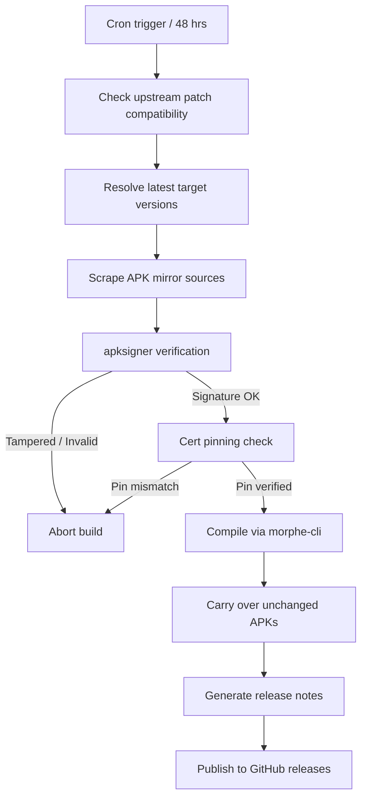

# Morphe-Automated-Build-Scripts

Pre-compiled, ad-free versions of 53 Android apps, rebuilt automatically every two days. You do not need to install patchers, run command lines, or compile anything yourself. 

> [!IMPORTANT]
> **Legal disclaimer**
> - **Non-affiliation:** This project is a personal compilation pipeline. It has no connection with Google, YouTube, Meta, Amazon, ByteDance, or any other trademark owner.
> - **Use at your own risk:** You are responsible for your own device and accounts. The author is not liable for bans, device issues, or terms of service violations.

---

## Quick start

### 1. Install GmsCore (For Google/YouTube apps only)
If you want to use **YouTube**, **YouTube Music**, or **Google Photos**, you must install [ReVanced GmsCore](https://github.com/ReVanced/GmsCore/releases/latest) first. This lets you sign into your Google account and keeps the apps from crashing.

### 2. Download your apps
Go to the **[Latest Release](../../releases/latest)** page, find the APK file for the app you want, download it, and install it on your phone.

---

## Supported applications

Here is the full list of all 53 apps. Expand any section to see package names and modified features.

<b>1. Morphe patches (3 apps)</b>

Patches focused on interfaces, ad-blocking, and media player enhancements.

| App | Package name | Core modifications |
|---|---|---|
| YouTube | `com.google.android.youtube` | Blocks ads, enables background playback, integrates SponsorBlock, and allows layout customisation. |
| YouTube Music | `com.google.android.apps.youtube.music` | Blocks ads, enables background playback, and unlocks premium audio player controls. |
| Reddit | `com.reddit.frontpage` | Blocks ads, adds media downloader options, and removes tracking. |

<b>2. Piko patches (2 apps)</b>

UI customisation and privacy-focused tweaks.

| App | Package name | Core modifications |
|---|---|---|
| Instagram | `com.instagram.android` | Blocks ads, adds AMOLED theme, enables anonymous DM and story viewing, disables reels auto-scrolling, and adds high-fidelity media downloads. |
| Twitter / X | `com.twitter.android` | Blocks ads, removes telemetry trackers, and adds login token import/export. |

<b>3. hoo-dles patches (16 apps)</b>

Utility, productivity, and subscription feature unlocks.

| App | Package name | Core modifications |
|---|---|---|
| AdGuard | `com.adguard.android` | Unlocks subscription tier features. |
| Amazon Prime Video | `com.amazon.avod.thirdpartyclient` | Blocks trackers and refines the interface. |
| Duolingo | `com.duolingo` | Unlocks Super Duolingo features (unlimited hearts, ad-blocking). |
| MyFitnessPal | `com.myfitnesspal.android` | Unlocks premium features. |
| Nova Launcher | `com.teslacoilsw.launcher` | Unlocks Nova Prime launcher features. |
| Solid Explorer | `pl.solidexplorer2` | Removes trial limitations. |
| Xodo PDF | `com.xodo.pdf.reader` | Unlocks premium PDF tools. |
| Ibis Paint X | `jp.ne.ibis.ibispaintx.app` | Unlocks premium drawing tools. |
| WPS Office | `cn.wps.moffice_eng` | Unlocks premium tools. |
| CamScanner | `com.intsig.camscanner` | Blocks ads, unlocks premium processing, and enables clean exports. |
| FotMob | `com.mobilefootie.wc2010` | Blocks ads and unlocks premium features. |
| Pandora | `com.pandora.android` | Enables premium audio playback. |
| Podcast Addict | `com.bambuna.podcastaddict` | Unlocks premium ad-free features. |
| ProtonVPN | `ch.protonvpn.android` | Unlocks subscription features. |
| Windy | `com.windyty.android` | Unlocks premium weather tools. |
| SofaScore | `com.sofascore.results` | Blocks ads and removes tracking. |

<b>4. De-ReVanced patches (32 apps)</b>

Messaging, streaming, utility, and social media clients.

| App | Package name | Core modifications |
|---|---|---|
| TikTok | `com.zhiliaoapp.musically` | Blocks ads, removes download watermarks, enables the seek bar, and allows auto-scrolling reels. |
| TikTok JP | `com.ss.android.ugc.trill` | Blocks ads and removes watermarks on downloaded videos. |
| Twitch | `tv.twitch.android.app` | Blocks live stream ads, claims channel points automatically, adds playback speed controls, and enables chat customisation. |
| Facebook | `com.facebook.katana` | Blocks feed and story ads, adds video downloading, and strips telemetry trackers. |
| Messenger | `com.facebook.orca` | Blocks ads in the chat list and removes tracking data. |
| Threads | `com.instagram.barcelona` | Blocks ads, strips tracking parameters, and allows direct media downloads. |
| Disney+ | `com.disney.disneyplus` | Blocks analytics and built-in trackers. |
| SoundCloud | `com.soundcloud.android` | Blocks ads, enables background play, and removes skipping limits. |
| Strava | `com.strava` | Blocks ads and displays additional stats. |
| Tumblr | `com.tumblr` | Blocks dashboard ads and tracking. |
| Amazon Shopping | `com.amazon.mShop.android.shopping` | Blocks ads and strips telemetry tracking. |
| Amazon Music | `com.amazon.mp3` | Blocks ads and enables background playback. |
| Google Photos | `com.google.android.apps.photos` | Enables unlimited backup by spoofing Pixel devices, unlocks DCIM backup controls, and bypasses signature checks for GmsCore. |
| Google News | `com.google.android.apps.magazines` | Blocks ads and removes premium source overlays. |
| Google Recorder | `com.google.android.apps.recorder` | Enables offline transcription and installs on non-Pixel phones. |
| ProtonMail | `ch.protonmail.android` | Unlocks Plus plan features and blocks tracking. |
| Viber | `com.viber.voip` | Blocks ads and removes telemetry. |
| Letterboxd | `com.letterboxd.letterboxd` | Blocks ads and unlocks premium app features. |
| Pixiv | `jp.pxv.android` | Blocks ads and unlocks high-resolution illustration searches. |
| Cricbuzz | `com.cricbuzz.android` | Blocks ads and unlocks premium subscription features. |
| Bandcamp | `com.bandcamp.android` | Unlocks premium play features and adds media downloading. |
| RAR | `com.rarlab.rar` | Blocks ads and unlocks premium tool options. |
| Photomath | `com.microblink.photomath` | Unlocks Plus features including detailed step-by-step math solutions. |
| Peacock TV | `com.peacocktv.peacockandroid` | Blocks tracking and reduces ad loads. |
| Nothing X | `com.nothing.smartcenter` | Unlocks Nothing device features for non-Nothing Android devices. |
| Inshorts | `com.nis.app` | Blocks ads and unlocks premium features. |
| Icon Pack Studio | `ginlemon.iconpackstudio` | Unlocks Pro tier features. |
| Hex Editor | `com.myprog.hexedit` | Blocks ads and unlocks Pro features. |
| GMX Mail | `de.gmx.mobile.android.mail` | Blocks ads and strips tracking data. |
| Angulus | `com.drinkplusplus.angulus` | Unlocks premium features. |
| IRplus | `net.binarymode.android.irplus` | Blocks ads and unlocks Pro features. |
| NU.nl | `nl.sanomamedia.android.nu` | Blocks ads and strips tracking. |

---

## Recent patch updates

<!-- PATCH-UPDATES-START -->
_Last checked: 2026-05-30_

### [Morphe v1.30.0](https://github.com/MorpheApp/morphe-patches/releases/tag/v1.30.0)
* **YouTube - DRC audio patch:** Add support for 21.19 and higher ([#1561](https://github.com/MorpheApp/morphe-patches/issues/1561))
* **YouTube - Hide ads:** Fix player crash
* **YouTube - Hide mix playlists:** improved filtering ([#1526](https://github.com/MorpheApp/morphe-patches/issues/1526))
* **YouTube - Hide Shorts components:** Hide new type of Shorts in search results
* **YouTube - Open channel of live avatar:** deprecated old WEB_REMIX client in favour of ANDROID_REELS ([#1519](https://github.com/MorpheApp/morphe-patches/issues/1519))
* **YouTube - Open channel of live avatar:** Improved check to exclude the live avatar in the channel header ([#1544](https://github.com/MorpheApp/morphe-patches/issues/1544))
* **YouTube - PlayerFlyoutMenuComponentsFilter:** filtering divider for overflow menu ([#1576](https://github.com/MorpheApp/morphe-patches/issues/1576))
* **YouTube - Reload video:** Allow reloading video that has not finished starting

### [De-ReVanced v1.0.4](https://github.com/RookieEnough/De-Vanced/releases/tag/v1.0.4)
* avoid forcing Photos frictionless login
* release v1.0.4 (Photos account persistence + TikTok defaults)
* stabilize Google Photos GmsCore support
* Enable **all** TikTok patches by default on **43.6.2** and **43.8.3**.
* Keep **Settings** + **Enable Open Debug** as **43.6.2-only** (not compatible with 43.8.3).

### [Piko v3.4.0](https://github.com/crimera/piko/releases/tag/v3.4.0)
* **Twitter:** Added warning during `Disunify xchat system` patch failure
* **Instagram - Translations:** Added `Japanese` Translation ([#1143](https://github.com/crimera/piko/issues/1143))
* **Instagram - Translations:** Added `Portuguese` Translation ([#1145](https://github.com/crimera/piko/issues/1145))
* **Twitter:** Partial support to 11.91.xx

### [hoo-dles v1.34.0](https://github.com/hoo-dles/morphe-patches/releases/tag/v1.34.0)
* **MacroFactor Workouts:** Bump version compatibility
* **Sleep as Android:** Add `Enable Premium` patch

<!-- PATCH-UPDATES-END -->

---

## Technical details (For developers)

This build pipeline contains several layers to keep the compilation process secure and reliable:

- **Automated scheduling:** Checks for compatible upstream updates and triggers rebuilds every 2 days using GitHub Actions.
- **Multi-mirror scraper:** Scrapes and downloads official APKs from verified sources (APKMirror, Uptodown, and APKPure) using custom Python scripts.
- **Signature verification and certificate pinning:** The pipeline validates the signature of every downloaded package using `apksigner`. It then cross-references the SHA-256 fingerprint with [.github/cert_pins.json](.github/cert_pins.json) before patching. If a package has a modified or mismatching signature, the build aborts immediately to protect against tampered upstream files.
- **Delta carry-over:** Carries over unchanged applications from the previous release. This saves build resources while keeping each release fully populated with the complete list of supported applications.

### Pipeline execution flow

## Requesting an app

To request a new application in the build sequence, open an [App Request Issue](../../issues/new?template=app_request.yml). The app will be added if it is supported by any of the four integrated patch bundles.
