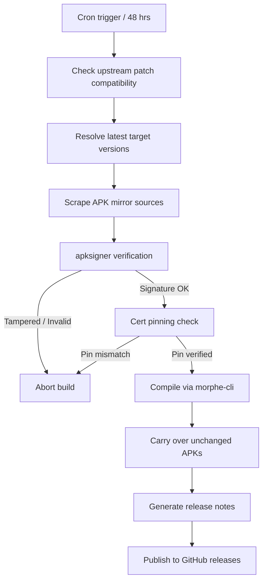

# Morphe-Automated-Build-Scripts

An automated build pipeline that fetches, verifies, patches, and publishes over 50 Android applications every 48 hours. The pipeline compiles these apps using the `morphe-cli` tool. It integrates patches from upstream open-source projects including [Morphe](https://github.com/MorpheApp), [De-ReVanced](https://github.com/RookieEnough/De-ReVanced), [Piko](https://github.com/crimera/piko), and [hoo-dles](https://github.com/hoo-dles/morphe-patches).

> [!IMPORTANT]
> **Legal disclaimer and safety warning**
> - **Non-affiliation:** This repository is an independent, non-commercial compilation pipeline. It is not affiliated, associated, authorized, endorsed by, or in any way officially connected with Google LLC, YouTube, Meta Platforms Inc., ByteDance Ltd., Amazon.com Inc., or any of their subsidiaries or affiliates. All product and company names are registered trademarks of their respective owners.
> - **No warranties:** Independent, third-party open-source contributors write and maintain all patches. This project only automates their compilation. The author does not write, maintain, or review the individual code of these upstream patches.
> - **Use at your own risk:** The author and contributors accept no responsibility or liability for any consequences of using these compiled binaries. This includes account suspensions, bans, device instability, data loss, or violations of third-party Terms of Service (ToS).

---

## Download and installation

**[→ Get the latest release](../../releases/latest)**

### Prerequisites
- **YouTube, YouTube Music, and Google Photos:** You must install [ReVanced GmsCore](https://github.com/ReVanced/GmsCore/releases/latest) first. This allows Google account sign-in and service spoofing.
- **Other standalone apps:** Install directly. No additional apps or helper frameworks are required.

---

## Pipeline architecture and security features

This build pipeline contains several layers to keep the compilation process secure and reliable:

- **Automated scheduling:** Checks for compatible upstream updates and triggers rebuilds every 2 days using GitHub Actions.
- **Multi-mirror scraper:** Scrapes and downloads official APKs from verified sources (APKMirror, Uptodown, and APKPure) using custom Python scripts.
- **Signature verification and certificate pinning:** The pipeline validates the signature of every downloaded package using `apksigner`. It then cross-references the SHA-256 fingerprint with [.github/cert_pins.json](.github/cert_pins.json) before patching. If a package has a modified or mismatching signature, the build aborts immediately to protect against tampered upstream files.
- **Delta carry-over:** Carries over unchanged applications from the previous release. This saves build resources while keeping each release fully populated with the complete list of supported applications.

---

## Supported applications

The pipeline compiles updates for **53 applications**. Expand each section below to view the package names and core modifications.

<b>1. Morphe patches (3 apps)</b>

Patches focused on interfaces, ad-blocking, and media player enhancements.

| App | Package name | Core modifications |
|---|---|---|
| **YouTube** | `com.google.android.youtube` | Blocks ads, enables background playback, integrates SponsorBlock, and allows layout customisation. |
| **YouTube Music** | `com.google.android.apps.youtube.music` | Blocks ads, enables background playback, and unlocks premium audio player controls. |
| **Reddit** | `com.reddit.frontpage` | Blocks ads, adds media downloader options, and removes tracking. |

<b>2. Piko patches (2 apps)</b>

UI customisation and privacy-focused tweaks.

| App | Package name | Core modifications |
|---|---|---|
| **Instagram** | `com.instagram.android` | Blocks ads, adds AMOLED theme, enables anonymous DM and story viewing, disables reels auto-scrolling, and adds high-fidelity media downloads. |
| **Twitter / X** | `com.twitter.android` | Blocks ads, removes telemetry trackers, and adds login token import/export. |

<b>3. hoo-dles patches (16 apps)</b>

Utility, productivity, and subscription feature unlocks.

| App | Package name | Core modifications |
|---|---|---|
| **AdGuard** | `com.adguard.android` | Unlocks subscription tier features. |
| **Amazon Prime Video** | `com.amazon.avod.thirdpartyclient` | Blocks trackers and refines the interface. |
| **Duolingo** | `com.duolingo` | Unlocks Super Duolingo features (unlimited hearts, ad-blocking). |
| **MyFitnessPal** | `com.myfitnesspal.android` | Unlocks premium features. |
| **Nova Launcher** | `com.teslacoilsw.launcher` | Unlocks Nova Prime launcher features. |
| **Solid Explorer** | `pl.solidexplorer2` | Removes trial limitations. |
| **Xodo PDF** | `com.xodo.pdf.reader` | Unlocks premium PDF tools. |
| **Ibis Paint X** | `jp.ne.ibis.ibispaintx.app` | Unlocks premium drawing tools. |
| **WPS Office** | `cn.wps.moffice_eng` | Unlocks premium tools. |
| **CamScanner** | `com.intsig.camscanner` | Blocks ads, unlocks premium processing, and enables clean exports. |
| **FotMob** | `com.mobilefootie.wc2010` | Blocks ads and unlocks premium features. |
| **Pandora** | `com.pandora.android` | Enables premium audio playback. |
| **Podcast Addict** | `com.bambuna.podcastaddict` | Unlocks premium ad-free features. |
| **ProtonVPN** | `ch.protonvpn.android` | Unlocks subscription features. |
| **Windy** | `com.windyty.android` | Unlocks premium weather tools. |
| **SofaScore** | `com.sofascore.results` | Blocks ads and removes tracking. |

<b>4. De-ReVanced patches (32 apps)</b>

Messaging, streaming, utility, and social media clients.

| App | Package name | Core modifications |
|---|---|---|
| **TikTok** | `com.zhiliaoapp.musically` | Blocks ads, removes download watermarks, enables the seek bar, and allows auto-scrolling reels. |
| **TikTok JP** | `com.ss.android.ugc.trill` | Blocks ads and removes watermarks on downloaded videos. |
| **Twitch** | `tv.twitch.android.app` | Blocks live stream ads, claims channel points automatically, adds playback speed controls, and enables chat customisation. |
| **Facebook** | `com.facebook.katana` | Blocks feed and story ads, adds video downloading, and strips telemetry trackers. |
| **Messenger** | `com.facebook.orca` | Blocks ads in the chat list and removes tracking data. |
| **Threads** | `com.instagram.barcelona` | Blocks ads, strips tracking parameters, and allows direct media downloads. |
| **Disney+** | `com.disney.disneyplus` | Blocks analytics and built-in trackers. |
| **SoundCloud** | `com.soundcloud.android` | Blocks ads, enables background play, and removes skipping limits. |
| **Strava** | `com.strava` | Blocks ads and displays additional stats. |
| **Tumblr** | `com.tumblr` | Blocks dashboard ads and tracking. |
| **Amazon Shopping** | `com.amazon.mShop.android.shopping` | Blocks ads and strips telemetry tracking. |
| **Amazon Music** | `com.amazon.mp3` | Blocks ads and enables background playback. |
| **Google Photos** | `com.google.android.apps.photos` | Enables unlimited backup by spoofing Pixel devices, unlocks DCIM backup controls, and bypasses signature checks for GmsCore. |
| **Google News** | `com.google.android.apps.magazines` | Blocks ads and removes premium source overlays. |
| **Google Recorder** | `com.google.android.apps.recorder` | Enables offline transcription and installs on non-Pixel phones. |
| **ProtonMail** | `ch.protonmail.android` | Unlocks Plus plan features and blocks tracking. |
| **Viber** | `com.viber.voip` | Blocks ads and removes telemetry. |
| **Letterboxd** | `com.letterboxd.letterboxd` | Blocks ads and unlocks premium app features. |
| **Pixiv** | `jp.pxv.android` | Blocks ads and unlocks high-resolution illustration searches. |
| **Cricbuzz** | `com.cricbuzz.android` | Blocks ads and unlocks premium subscription features. |
| **Bandcamp** | `com.bandcamp.android` | Unlocks premium play features and adds media downloading. |
| **RAR** | `com.rarlab.rar` | Blocks ads and unlocks premium tool options. |
| **Photomath** | `com.microblink.photomath` | Unlocks Plus features including detailed step-by-step math solutions. |
| **Peacock TV** | `com.peacocktv.peacockandroid` | Blocks tracking and reduces ad loads. |
| **Nothing X** | `com.nothing.smartcenter` | Unlocks Nothing device features for non-Nothing Android devices. |
| **Inshorts** | `com.nis.app` | Blocks ads and unlocks premium features. |
| **Icon Pack Studio** | `ginlemon.iconpackstudio` | Unlocks Pro tier features. |
| **Hex Editor** | `com.myprog.hexedit` | Blocks ads and unlocks Pro features. |
| **GMX Mail** | `de.gmx.mobile.android.mail` | Blocks ads and strips tracking data. |
| **Angulus** | `com.drinkplusplus.angulus` | Unlocks premium features. |
| **IRplus** | `net.binarymode.android.irplus` | Blocks ads and unlocks Pro features. |
| **NU.nl** | `nl.sanomamedia.android.nu` | Blocks ads and strips tracking. |

---

## Recent patch updates

<!-- PATCH-UPDATES-START -->
_Updated automatically — check back after the next scheduled run._
<!-- PATCH-UPDATES-END -->

---

## Pipeline execution flow

## Requesting an app

To request a new application in the build sequence, open an [App Request Issue](../../issues/new?template=app_request.yml). The app will be added if it is supported by any of the four integrated patch bundles.
